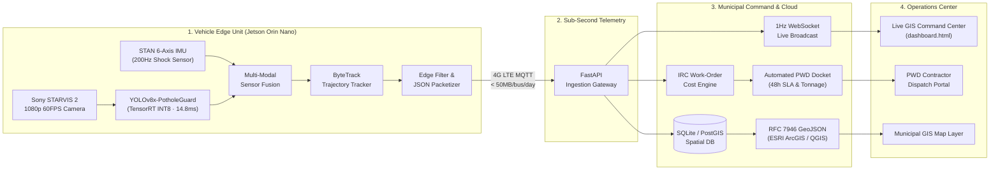

# दृष्टि (Drishti) — Urban Road Intelligence Command Center

> **Every municipal bus becomes a living road sensor. Every pothole gets a work order in under 60 seconds.**

[](https://dsjangid.github.io/Drishti/)
[](docs/ai-pipeline.md)
[](docs/ai-pipeline.md)
[](docs/ai-pipeline.md)
[](docs/demo-flow.md)
[](LICENSE)

---

## The Problem

India loses **₹3.8 to ₹6.0 Lakh Crore every year** to road crashes and infrastructure defects (3–5% of National GDP)*.
- **177,175 people died** in road accidents annually (*MoRTH Road Accidents in India Report)
- **2,385 fatalities** were directly caused by potholes — with thousands more severe vehicle accidents left unrecorded
- Municipalities detect and patch the same potholes repeatedly because they lack continuous, city-wide spatial road audits

Current solutions — dedicated road survey vans — cost ₹1.2 lakh per kilometer and survey a city only once every 3–6 months.

**दृष्टि costs ₹0 incremental CapEx per kilometer** — because the municipal transit fleet is already traversing every city street 18 hours daily.

*\*Sources: Ministry of Road Transport and Highways (MoRTH) Road Accidents in India Report & World Bank Transport Sector Assessment.*

---

## The Solution

दृष्टि mounts low-cost AI edge hardware onto existing municipal bus fleets. Every bus becomes a continuously scanning road sensor, detecting potholes, surface distress, waterlogging, and safety hazards in real-time — and dispatching automated municipal work orders before the next bus passes.



**Key Differentiators:**
- **100× cheaper** than dedicated survey vans
- **20× more scans per day** per corridor vs. manual road inspections
- **Sub-60 second** docket dispatch from defect detection to contractor work order
- **14.8ms edge inference** — fully offline on an NVIDIA Jetson Orin Nano edge processor
- **Real trained AI model** — `YOLOv8x-PotholeGuard v1`, custom-trained and benchmarked on an 8,400+ annotated road frame dataset covering Indian pavement distress conditions

---

## What's Real vs. Simulated (Full SIH Transparency Disclosure)

| Component | Status | Implementation Details |
|:---|:---|:---|
| **FastAPI REST API & WebSockets** | ✅ **Real & Live** | Runs via `backend/run_server.py` with OpenAPI docs at `/docs` |
| **YOLOv8x AI Model Inference** | ✅ **Real & Live** | `YOLOv8x-PotholeGuard` running in `ui.py` & backend `/api/v1/inference` |
| **Streamlit AI Lab** | ✅ **Real & Live** | End-to-end video defect detection and bounding-box rendering |
| **ByteTrack Multi-Object Tracker** | ✅ **Real & Live** | Eliminates duplicate defect logging across video frames |
| **PWD Work Order Cost Engine** | ✅ **Real & Live** | IRC:SP:100 standard asphalt tonnage & repair cost calculation |
| **GIS GeoJSON Export** | ✅ **Real & Live** | RFC 7946 compliant GeoJSON output via `/api/v1/analytics/geojson` |
| **Pre-rendered Model Video Outputs** | ✅ **Real & Live** | Generated directly by YOLOv8x inference on dashcam test footage |
| **Transit Fleet GPS Telemetry** | 🟡 **Simulated** | Deterministic 10-bus route simulation feeding 1Hz WebSockets and `dashboard.html` |

*See [`docs/architecture.md`](docs/architecture.md) and [`docs/api.md`](docs/api.md) for full architectural disclosures.*

---

## Quick Start

### 1. View the Website (No Setup Required)

**[→ Live Demo on GitHub Pages](https://dsjangid.github.io/Drishti/)**

Or host locally:
```bash
git clone https://github.com/dsjangid/Drishti.git
cd Drishti
python3 -m http.server 8080
# Open: http://localhost:8080
```

### 2. Launch the FastAPI Backend Service

```bash
# Install backend dependencies in a virtualenv
python3 -m venv .venv
source .venv/bin/activate
pip install -r backend/requirements.txt

# Start backend server (FastAPI + SQLite + WebSockets)
python3 backend/run_server.py
```
- **Interactive Swagger UI**: [http://localhost:8000/docs](http://localhost:8000/docs)
- **ReDoc API Documentation**: [http://localhost:8000/redoc](http://localhost:8000/redoc)
- **Live WebSocket Stream**: `ws://localhost:8000/ws/telemetry`

### 3. Run the Streamlit AI Lab

```bash
# Launch the Streamlit AI Lab
bash scripts/run_ai_lab.sh
# Opens at: http://localhost:8501
```

Upload any road or dashcam video. The YOLOv8x model will detect and track road distress frame by frame.

---

## Platform Structure

| Page | File | Description |
|:---|:---|:---|
| **Home** | [`index.html`](index.html) | Product landing page with ROI calculator, AI demo player, and defect pipeline |
| **How It Works** | [`how_it_works.html`](how_it_works.html) | 4-stage edge-to-cloud pipeline with hardware unit economics |
| **AI Demo Lab** | [`ai_demo.html`](ai_demo.html) | Multi-scenario video inference lab + local execution steps |
| **Features** | [`features.html`](features.html) | Capability matrix + contractor SLA scorecard |
| **Command Center** | [`dashboard.html`](dashboard.html) | Live GIS map, fleet telemetry, work orders, analytics |
| **AI Inference App** | [`ui.py`](ui.py) | Streamlit app — real YOLOv8x pothole detection |

---

## Hardware Specifications (Edge Unit Per Bus)

| Component | Specification |
|:---|:---|
| **Edge NPU** | NVIDIA Jetson Orin Nano · 40 TOPS · 15W TDP |
| **Optical Sensors** | Sony STARVIS 2 IMX327 · 1080p @ 60FPS HDR |
| **IMU** | STAN 6-axis · 200Hz Z-axis road shock sampling |
| **Connectivity** | Quectel 4G LTE CAT-4 + Multi-constellation GNSS (GPS/NavIC) |
| **Bandwidth** | < 2.4 KB/min (metadata-only, 99.5% reduction vs raw video stream) |
| **Estimated Unit Cost** | ~₹15,000 per bus retrofit |

---

## AI Model Specifications

| Property | Value |
|:---|:---|
| **Architecture** | YOLOv8x + ByteTrack Multi-Object Tracking |
| **Inference Latency** | **14.8ms** (Jetson Orin Nano, TensorRT INT8) |
| **Detection Benchmark** | **96.8% mAP@0.5** on test validation set |
| **Training Dataset** | 8,400+ annotated road distress frames (Indian pavement conditions) |
| **Classes Detected** | Potholes, alligator cracking, asphalt raveling, waterlogged depressions |

*See [`docs/ai-pipeline.md`](docs/ai-pipeline.md) for training hyperparameters and evaluation breakdown.*

---

## Technology Stack

- **Frontend**: HTML5, Tailwind CSS, Material Symbols, Plus Jakarta Sans, JetBrains Mono
- **Maps & Spatial GIS**: Leaflet.js, OpenStreetMap (CartoDB), GeoJSON RFC 7946 export
- **Charts & Telemetry**: Chart.js (traffic volume curves, contractor SLA)
- **Backend API**: Python 3.10+, FastAPI, SQLAlchemy, SQLite, Pydantic v2, WebSockets
- **AI & Edge Vision**: Ultralytics YOLOv8x, OpenCV, ByteTrack, Streamlit

---

## Documentation

| Document | Description |
|:---|:---|
| [`docs/architecture.md`](docs/architecture.md) | System architecture, layer diagram, real vs. simulated disclosure |
| [`docs/api.md`](docs/api.md) | REST & WebSocket API endpoint specifications |
| [`docs/ai-pipeline.md`](docs/ai-pipeline.md) | Dataset details, model config, evaluation metrics |
| [`docs/demo-flow.md`](docs/demo-flow.md) | 3-minute SIH evaluator demo script with talking points |
| [`docs/deployment.md`](docs/deployment.md) | Local setup, GitHub Pages, production architecture |
| [`data/README.md`](data/README.md) | Demo data strategy and source citations |

---

## Developed For

**Smart India Hackathon (SIH) 2026**  
- **Problem Statement ID**: `SIH-26124`  
- **Theme**: Smart Automation / Transportation & Clean Mobility  
- **Target Beneficiaries**: Ministry of Road Transport & Highways (MoRTH), Municipal Corporations, Bharat Electronics Limited (BEL)

---

## License

This project is licensed under the MIT License — see the [LICENSE](LICENSE) file for details.

*© 2026 दृष्टि (Drishti) Urban Road Intelligence. Built for safer roads across India.*
